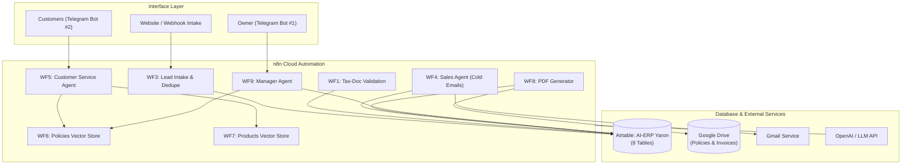

# AI-ERP with n8n — John Bryce Final Project

A small, learning-oriented ERP and AI automation system for an Israeli electronics business (**איי.איי אלקטרוניקה בע"מ**), built with **n8n Cloud**, **Airtable**, and **AI Agents with RAG**.

* **Author**: Yaron
* **Database**: Airtable (`AI-ERP Yaron`)
* **Automation**: n8n Cloud
* **Storage**: Google Drive

---

## Architecture Overview



---

## What's in the Box

* **3 Autonomous AI Agents**:
  1. **Manager Agent (WF9)**: Owner-only financial analytics, overdue invoice tracking (> שוטף+30), low inventory alerts, and task dispatching.
  2. **Customer Service Agent (WF5)**: 24/7 customer support grounded in company policy documents and live product catalogue via vector embeddings.
  3. **Sales Outreach Agent (WF4a & WF4b)**: Automated lead processing, cold email generation, and response heartbeat.

* **8 Core Airtable Tables** (`schema/schema.json`):
  * `Leads`, `Customers`, `Products`, `Tasks`, `Invoices`, `TaxInvoices`, `Receipts`, `Orders`.

* **Israeli Tax Compliance**:
  * **18% VAT** calculation (compliant with current Israeli tax law).
  * Strict distinction between *Invoice (חשבונית)*, *Tax Invoice (חשבונית מס)*, and *Receipt (קבלה)*.
  * PDF invoice rendering via HTML templates in `templates/`.

---

## Workflow Inventory

| # | Workflow | Trigger | Action |
|---|---|---|---|
| **WF1** | Tax-Doc Validation | New Invoice / Receipt | Validates sequential numbers & tax rules, queues for PDF |
| **WF3** | Contact Intake & Dedupe | Webhook / New Lead | Deduplicates by email, registers in Airtable |
| **WF4a** | Sales Cold Emails | Schedule (Every 3 hrs) | Drafts personalized B2B pitch, sends via Gmail |
| **WF4b** | Sales Reply Check | Gmail polling | Flags interested leads, updates status |
| **WF5** | Customer Service Agent | Telegram Bot #2 | Answers questions using vector search over policies & catalog |
| **WF6** | Policies Embedding | Manual / Startup | Embeds 12 policy files into n8n vector store |
| **WF7** | Products Embedding | Manual / Startup | Embeds product catalogue into n8n vector store |
| **WF8** | PDF Invoice Generator | File Queue trigger | Renders HTML template, converts to PDF, saves in Drive |
| **WF9** | Manager Agent | Telegram Bot #1 | Authenticates owner ID, returns KPI reports & task tools |

---

## Repository Layout

```
jb-erp-ai/
├── README.md                 # Project documentation & architecture
├── AGENTS.md                 # Agent specifications, roles, and guardrails
├── index.html                # Visual ERP Admin Dashboard & Landing Page (RTL, 18% VAT, AI Chat)
├── .gitignore                # Environment and secret ignores
│
├── schema/
│   └── schema.json           # Single source of truth: 8 Airtable tables & field types
│
├── data/
│   └── policies/             # 12 company policy markdown docs (*.md) for RAG
│
├── mock/
│   └── products.csv          # Product catalogue
│
├── templates/
│   ├── invoice.html          # RTL Hebrew Tax Invoice template
│   └── receipt.html          # RTL Hebrew Receipt template
│
├── docs/
│   ├── 01-airtable.md        # Airtable Base & PAT configuration
│   ├── 02-telegram-bots.md   # Telegram bot setup with @BotFather
│   ├── 03-google-oauth.md    # Gmail & Google Drive OAuth2 setup
│   └── 04-workflows.md       # Canvas layout and credential wiring
│
└── workflows/                # Exported n8n workflow JSON files
```

---

## Setup Instructions

1. **Airtable Database**:
   * Create an Airtable base named `AI-ERP Yaron` using `schema/schema.json`.
   * Create a Personal Access Token with `data.records` and `schema.bases` scopes.

2. **n8n Credentials**:
   * Create credentials matching the standard names:
     * `Airtable PAT`
     * `Chat Model` (OpenAI API compatible)
     * `Embeddings API` (OpenAI API compatible)
     * `Telegram Manager Bot`
     * `Telegram Support Bot`
     * `Gmail OAuth`
     * `Drive OAuth`

3. **Import Workflows**:
   * Import the JSON files from `/workflows` directly into n8n Cloud.
   * Run **WF6** and **WF7** once to populate the in-memory vector stores.
